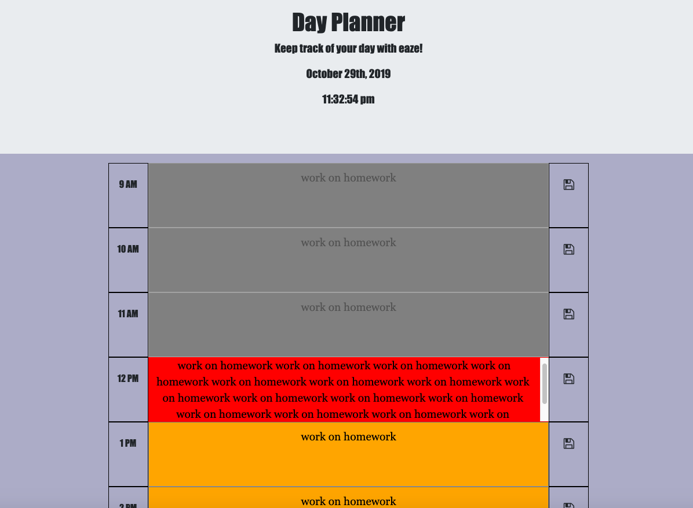

# Day-Planner

This is a daily planner application, that allows a user to save tasks or todos
for each hour of the day from 9am-5pm. Today's date and time are are posted at 
the top of the page in real time. Each hour is colored according to
past, present and future. Once an hour has passed, the area becomes disabled.

## Deployed URL

[Day-Planner](https://jordancley.github.io/Day-Planner/)

## Author

* **Jordan McQuiston** 